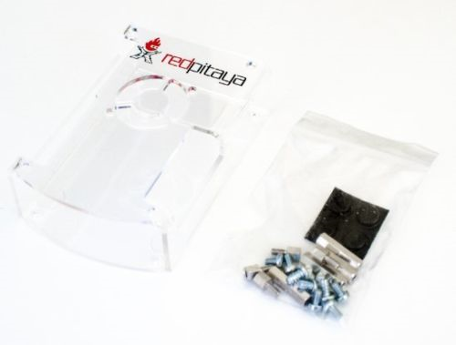

.. _pvccase:

#################################
Red Pitaya 亚克力外壳组装
#################################

无论 Red Pitaya 亚克力外壳是随套件购买还是作为独立附件购买，都需要手动组装。

组件
===========

   Red Pitaya 亚克力外壳的组件。
    
包装内容：

    * 8 颗用于闭合外壳的螺钉。
    * 4 个长黄铜隔离柱和 4 个短黄铜隔离柱，用于固定板卡。
    * 4 个橡胶脚垫，用于将外壳稳固放置在桌面上。

兼容性
==================

亚克力外壳兼容以下 Red Pitaya 型号：

    * STEMlab 125-14 Gen 2（含 PRO 和 PRO Z7020）
    * STEMlab 125-14 TI
    * STEMlab 65-16 TI
    * STEMlab 125-14 (all board models)
    * STEMlab 122-16
    * STEMlab 125-14 4-Input
    * STEMlab 125-10

|

组装说明
=====================

#. 使用小钳子按压顶部卡扣，同时向下推脚垫，拆下白色小塑料脚垫。
   
    .. figure:: img/rp_pvccase_02.jpg
        :align: center
        :width: 800

    Red Pitaya 板卡底部的塑料脚垫。

#. 按下图所示安装黄铜隔离柱：
   
    .. figure:: img/rp_pvccase_03.jpg 
        :align: center
        :width: 800

#. 如果你的型号带有 6 针连接器，请使用随附的白色塑料垫圈。

    .. figure:: img/rp_pvccase_04.jpg 
        :align: center
        :width: 800

    带有 6 针连接器 CN11 的 Red Pitaya PCB 底部。

    .. figure:: img/rp_pvccase_05.jpg 
        :align: center
        :width: 800

    如果存在 CN11 连接器，安装底板时请使用随附的塑料垫圈。

    .. figure:: img/rp_pvccase_06.jpg 
        :align: center
        :width: 800

    Red Pitaya 上使用白色塑料垫圈，为 6 针连接器 CN11 留出间隙。

#. 装入橡胶脚垫。
