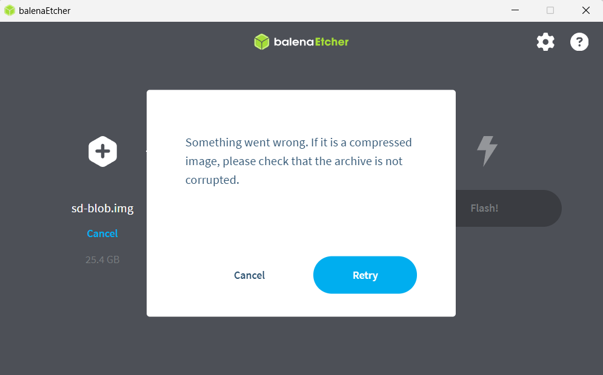
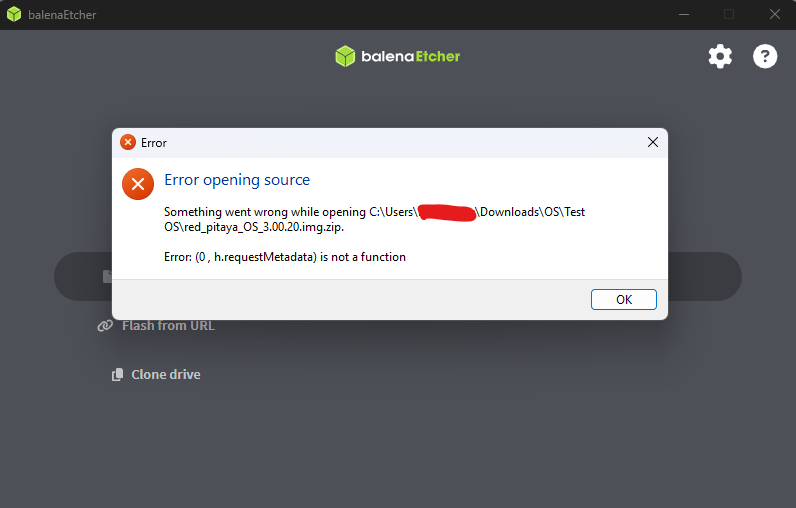
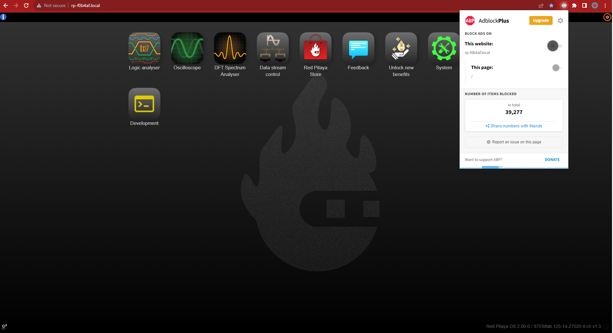
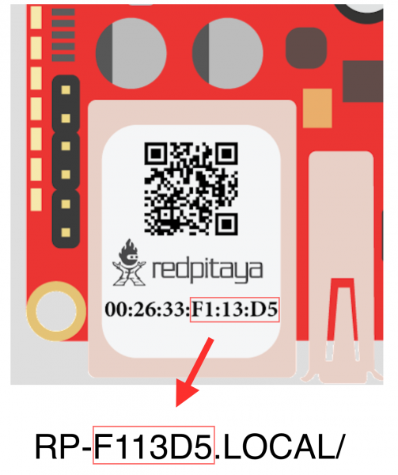

.. _faq:

######
FAQ
######

本页是常见 Red Pitaya 问题的主要入口。如果板卡无法启动、不断重启、无法通过网络访问，或原因仍不明确，请先执行 :ref:`故障排查流程 <troubleshooting>`，再按需返回下面的 FAQ 主题。

.. contents:: 本页内容
    :local:
    :depth: 2

.. note::

    没有找到所需内容？请 :ref:`联系我们 <report_problem>`，并提供所有相关信息。为便于排查 OS 2.00 及更高版本的问题，也请在 Red Pitaya 主页左下角提供 :ref:`下载的系统报告 <system_info>`。

.. _faq_sw:

软件
===========

有关建立 SSH 连接、创建自定义 FPGA 镜像、自定义 ecosystem 和/或自定义 Web 应用，请参阅 :ref:`开发者指南：软件 <dev_guide_software>`。

如何使用 Red Pitaya 采集数据？
------------------------------------------------

    * :ref:`使用 Red Pitaya 进行数据采集和生成简介 <intro_gen_acq>`。

如何使用 Red Pitaya 生成数据？
------------------------------------------------

    * :ref:`使用 Red Pitaya 进行数据采集和生成简介 <intro_gen_acq>`。

如何使用 LabVIEW、MATLAB 和 Python 远程控制 Red Pitaya？
-----------------------------------------------------------------------

    * :ref:`远程控制 <scpi_commands>`。

在哪里可以找到 ecosystem、软件和 FPGA 镜像？
------------------------------------------------------------

    * |RP_GitHub| - 旧版 ecosystem 请查看对应分支。
    * |RP_GitHub_FPGA|。
    * |RP_archive| - 软件存档（部分镜像可能需要单独安装 ecosystem 和 Linux OS）。请查看 :ref:`nightly build 安装说明 <nightly_build_installation>`。

.. note::

    *不可能。存档可能不完整。*

    如果存档中缺少特定旧版 ecosystem 或 OS，建议在 |redpitaya-forum| 上向社区求助。

如何开始 FPGA 开发？
-------------------------------------

    * :ref:`软件 <dev_guide_software>`。
    * :ref:`FPGA 教程 <fpga_top>`。

安装 Python 软件包有什么限制吗？
-------------------------------------------------

没有限制。凡是可以在 Ubuntu Linux 上安装的软件包，都可以在 Red Pitaya 上安装。安装失败通常是因为：

    * **SD 卡空间不足。** 某些软件包需要大量空间。
    * **内存不足。** 安装需要大量内存时，可能无法在 Red Pitaya（512 MB RAM）上完成。

启用 ``swap`` 无法解决这个问题。从源代码 tarball 构建可能有所帮助；如果仍失败，可将 SD 卡插入计算机，在 Linux OS 中安装软件包，再放回 Red Pitaya。

.. _faq_hw:

硬件
===========

有关硬件原理图、step 模型和规格，请参阅 :ref:`开发者指南：硬件 <dev_guide_hardware>`。

在哪里可以找到 Red Pitaya 原理图、3D 模型 (.step) 和重要元件？
--------------------------------------------------------------------------------------

请查看 **开发者指南：硬件 => 板卡型号 => 原理图、机械规格和 3D 模型**，或使用以下板卡专用链接：

    * :ref:`STEMllab 125-14 Gen 2 <top_125_14_gen2>`。
    * :ref:`STEMlab 125-14 <top_125_14>`。
    * :ref:`SDRlab 122-16 <top_122_16>`。
    * :ref:`SIGNALlab 250-12 <top_250_12>`。
    * :ref:`STEMlab 125-10 <top_125_10>`。

如何在 STEMlab 125-14 PRO Z7020 Gen 2 上启用 1 GB RAM？
--------------------------------------------------------------

进入 Web 界面的 :ref:`系统信息 <system_info>` 页面，查看 **BOOT mode**。如果显示 512 MB，点击切换为 1 GB，然后重启板卡。该选项仅适用于具有 1 GB RAM 的板卡（SIGNALlab 250-12 和 STEMlab 125-14 PRO Z7020 Gen 2）。

FPGA、ADC 和 DAC 是否同步？
----------------------------------------

是的，所有 Red Pitaya 板卡上的 FPGA、ADC 和 DAC 都同步（共享同一时钟信号），因此数据采集和生成可实现精确的时序协调。

普通板卡与 OEM 版本之间有硬件差异吗？
--------------------------------------------------------------------------------------

没有，硬件完全相同。OEM 板卡不附带 starter kit 中的额外配件（电源、SD 卡等）。

STEMlab 125-14 与 STEMlab 125-14 Low Noise 有什么区别？
--------------------------------------------------------------------------------------

STEMlab 125-14 Low Noise 增加线性电源稳压器，可降低快速模拟输出上的噪声；这是两者唯一差异。详见 :ref:`STEMlab 125-14 Low Noise 文档 <top_125_14_LN>`。所有 Gen 2 板卡默认都是 Low Noise。

STEMlab 125-14 与 ISO17025 版本之间有硬件差异吗？
--------------------------------------------------------------------------------------

没有，硬件完全相同。唯一区别是后者曾送往认证实验室并完成相应测量。

“Calibrated kit”中的 STEMlab 125-14 板卡经过校准吗？
--------------------------------------------------------------------------------------

是的，该板卡经过出厂校准。实际上所有 Red Pitaya 板卡无论套件类型都经过出厂校准；必要时可通过 :ref:`校准工具 <calibration_app>` 重新校准。需要校准证书时，请查看 :rp-store:`ISO17025 <stemlab-125-14-iso17025>` 版本。

不同 Red Pitaya 板卡之间的主要区别是什么？
---------------------------------------------------------------------

请查看：

* :ref:`Original Gen 板卡对比表 <rp-board-comp-orig_gen>`。
* :ref:`Gen 2 板卡对比表 <rp-board-comp-gen2>`。

Red Pitaya 板卡的带宽是多少？
-------------------------------------------------

所有板卡都工作在基带（通常约为 DC 至 60 MHz）。要达到更高频率范围，需要额外模拟前端模块（如频率混频器）。SDRlab 122-16（核心时钟频率 122.88 MHz）采用 AC 耦合，将低频限制为 300 kHz，并可将 550 MHz 信号降采样到基带。

.. _report_problem:

如何报告问题？
=========================

请将以下信息发送到 support@redpitaya.com：

    * **Red Pitaya 型号：** 所使用的型号。
    * **OS 版本：** Red Pitaya OS 版本。
    * **问题描述：** 问题详情及其他相关信息。
    * **视觉材料：** 显示状态 LED 或板卡状态的图片或视频。
    * **复现步骤：** 清晰的复现说明。
    * **Bug 报告：** 在 Web 界面中：

        1. 点击 :ref:`Red Pitaya Web 界面 <system_info>` **左下角**的操作按钮，选择 **Download system bug report**。
        2. Web 界面不可访问时，通过 :ref:`SSH <ssh>` 直接运行：

            .. code-block:: bash

                /opt/redpitaya/sbin/scripts/bug_report.sh

.. substitutions - 使用新的集中式链接管理系统

.. |Wifi channel| replace:: `更改 Wi-Fi 路由器信道以优化无线信号 <https://helpdeskgeek.com/how-to-change-your-wi-fi-channel-and-improve-performance/>`__
.. |Wireless Diagnostic Tool| replace:: `Wireless Diagnostic Tool <https://www.howtogeek.com/211034/troubleshoot-and-analyze-your-macs-wi-fi-with-the-wireless-diagnostics-tool/>`__
.. |#250| replace:: :rp-github:`#250 <RedPitaya/issues/250>`
.. |#254| replace:: :rp-github:`#254 <RedPitaya/issues/254>`
.. |RP_GitHub| replace:: |redpitaya-github| ecosystem
.. |RP_GitHub_FPGA| replace:: :rp-github:`Red Pitaya FPGA <RedPitaya-FPGA>`
.. |RP_archive| replace:: :rp-download:`Red Pitaya archive <downloads/>`

.. _faq_os:

OS
=====

如何更新和升级 OS？
----------------------------

    * :ref:`OS 更新选项 <os_update>`。

OS 更新后 Red Pitaya 仍无法启动？
-------------------------------------------------

    * 板卡未正常完成启动时，从 :ref:`故障排查流程 <troubleshooting>` 开始。
    * 使用 Balena Etcher 应用 :ref:`手动重写 OS <prepareSD>`。
    * **从旧版 Red Pitaya OS 升级到 OS 2.00 或更高版本？** 请尝试 |#250| 和 |#254|。

Red Pitaya 更新失败？
----------------------------------

有两种可能的解决方案：

1. 如果 :ref:`软件更新工具 <software_update_manager>` 报告 Red Pitaya 离线，请将其连接到可访问互联网的以太网插口。直接连接设备不会自动共享互联网，除非完成相应配置。
#. 使用 Balena Etcher 应用 :ref:`手动重写 SD 卡上的 Red Pitaya OS <prepareSD>`。

Balena Etcher 报告存档损坏？
----------------------------------------

使用 Balena Etcher 将 OS 镜像刷写到 SD 卡时出现以下错误：

请删除 SD 卡上的分区后再次刷写。删除方法参见 :ref:`OS 分区 <SDcard_partitions>`。在已包含旧版 Red Pitaya OS 的 SD 卡上安装新 OS 时有时会出现此错误。请 **以管理员模式重新启动 Balena Etcher**，然后再次刷写。

Balena Etcher Error (0, h.requestMetadata) is not a function 错误？
---------------------------------------------------------------------

使用 Balena Etcher 刷写 OS 镜像时出现以下错误：

请 **以管理员模式重新启动 Balena Etcher**，然后再次刷写。

.. _faq_apis_interface:

应用与 Web 界面
===============================

如何开始使用 Red Pitaya 测量应用？
-----------------------------------------------------------

* :ref:`连接到 Red Pitaya <quickstart_connect>`。

设备显示的测量值不正确。如何校准？
-----------------------------------------------------------------

可使用 :ref:`校准工具 <calibration_app>` 校准 Red Pitaya。建议先进行直流校准，必要时再进行频率校准。

Red Pitaya 的输入或输出没有信号？
-------------------------------------------------------------------------

请检查：

1. :ref:`输入跳线 <jumper_pos>`。跳线有时接触不良，需要拔下后重新插入；松动或缺失时请更换。
#. Web 界面中的 :ref:`校准设置 <calibration_app>`。错误校准可能导致错误测量，甚至看起来完全检测不到信号；必要时检查直流和频率校准并恢复出厂默认值。
#. :ref:`故障排查指南 <troubleshooting>` 中的硬件和软件问题。

OS 更新应用有问题，或无法访问 marketplace？
-----------------------------------------------------------------------

1. 确认 Red Pitaya 可以访问 :ref:`互联网 <faq_internetAccess>`。
#. 强制刷新应用页面，参阅 |WikiHow-refresh|。
#. 更新 OS 可能需要很长时间；最快的方法是 :ref:`手动重写 SD 卡上的 OS <prepareSD>`。

.. note::

    OS 2.07-48 及更高版本已从 Web 界面移除应用 marketplace，相关应用将逐步迁移到新的官方 OS。

Web 界面运行不正常或冻结？
------------------------------------------------------

完全无法访问 Web 界面时先进入 :ref:`故障排查流程 <troubleshooting>`；页面能加载但行为异常时，请确认针对 ``rp-xxxxxx.local`` 已关闭广告拦截器且代理设置正确。连接本地 Red Pitaya 通常不需要代理，VPN 也可能阻止连接。

可以尝试：

1. 更新 Google Chrome。
2. 针对 ``rp-xxxxxx.local`` 禁用广告拦截器。
3. 禁用 VPN。
4. 清除 ``rp-xxxxxx.local`` 网站的 Cookie。
5. 尝试 *隐身模式*。
6. 将 Red Pitaya OS 更新到 :ref:`最新版本 <prepareSD>`。

频繁断开连接？
---------------------------

在建立稳定连接前就断开时先执行 :ref:`故障排查流程 <troubleshooting>`。这是 1.04 OS 及更早版本的常见问题，已在 OS 2.00 及更高版本修复；旧版用户请 :ref:`升级到最新 OS <prepareSD>`。建议 :ref:`将 Red Pitaya 连接到路由器 <network_manager>` 后重试。若仍有问题，请用另一台计算机和另一个网络测试，并检查以太网线、电源、代理设置和 OS 重写状态。

某个应用无法工作？
--------------------------------

若故障表现为一般启动、网络或 Web 界面问题，请先执行 :ref:`故障排查流程 <troubleshooting>`。建议 :ref:`升级到最新 OS <prepareSD>` 后重试，否则请 :ref:`报告问题 <report_problem>`。

.. note::

    Red Pitaya 社区开发的应用并非由 Red Pitaya 团队分发或测试，本团队不承担责任。反馈、报告 bug 或寻求帮助时，请联系项目作者。

.. note::

    OS 2.00 及更高版本将 Ubuntu 更新为 22.04 LTS（或更高版本），并引入 AMD Xilinx 对 FPGA 比特流加载方式的注册表变化。所有官方应用都已更新以适应新结构，但部分第三方应用尚未更新，可能无法在最新 OS 上工作。建议将 OS 降级到 1.04 或使用其他应用。

Lock-in PID 应用
--------------------------------------

下面是兼容 Red Pitaya 板卡的 lock-in 和 PID 应用。部分应用由第三方开发，Red Pitaya 团队可能不提供支持。

.. list-table::
   :widths: 20 15 30 25 30
   :header-rows: 1

   * - **Lock-in PID 应用**
     - **应用类型**
     - **兼容的 Red Pitaya OS**
     - **Red Pitaya 板卡兼容性**
     - **文档链接**
   * - Linien
     - 第三方
     - 3.00（当前不可用）；2.00-15 及更高版本；1.04（兼容性有限）
     - STEMlab 125-14 (LN, Ext. clk)；STEMlab 125-14 (PRO) Gen 2
     - :github:`Linien GitHub <linien-org/linien>`
   * - Lock-in+PID (Marcelo Luda)
     - 第三方
     - 3.00（当前不可用）；2.00 或更高版本；1.04
     - STEMlab 125-14 (LN, Ext. clk)；STEMlab 125-10；STEMlab 125-14 (PRO) Gen 2
     - |Marcelo-Lock-in|
   * - PyRPL
     - 第三方
     - 3.00（当前不可用）；2.00 或更高版本；1.04
     - STEMlab 125-14 (LN, Ext. clk)；STEMlab 125-10；STEMlab 125-14 (PRO) Gen 2
     - |PyRPL|

.. note::

    2.00 Unified OS 将 Ubuntu 更新为 22.04 LTS，并引入 AMD Xilinx 的 FPGA 比特流加载注册表变化。部分第三方应用未适配最新 OS；请查看应用网站获取兼容更新，或将 OS 降级到 1.04、使用其他应用。

从这里开始
============

请按以下顺序使用链接：

1. 问题尚不明确时，遵循 :ref:`故障排查流程 <troubleshooting>`。
2. 已知问题类别时，跳转到本页相应 FAQ 部分。
3. 主题涉及特定产品或版本时，使用 :ref:`专用 FAQ 和参考页面 <specialized_faq_pages>`。

故障排查指南适用于板卡无法启动、不断重启、缺少 Web 界面或 SSH、硬件或软件故障不明确，以及尚不能确定问题由板卡、网络、OS 还是应用导致的情况。

常见 FAQ 主题
===================

以下部分回答已知一般问题类别后的常见问题：

* :ref:`连接 <faq_connectivity>` - 网络设置、本地访问、Wi-Fi 和主机名。
* :ref:`OS <faq_os>` - OS 更新、安装和恢复。
* :ref:`应用与 Web 界面 <faq_apis_interface>` - 应用行为、校准和浏览器问题。
* :ref:`软件 <faq_sw>` - 远程控制、FPGA 开发、代码仓库和 Python 软件包。
* :ref:`硬件 <faq_hw>` - 原理图、板卡差异、校准和带宽。
* :ref:`如何报告问题？ <report_problem>` - 向支持团队发送的信息。

.. _specialized_faq_pages:

专用 FAQ 和参考页面
====================================

这些页面用于板卡专用、API 专用或高级参考信息：

* :ref:`软件故障排查 <sw_troubleshooting>` - OS 兼容性说明和已知软件问题。
* :ref:`已知硬件问题（Original Gen） <known_hw_issues_orig_gen>` - Original Gen 硬件问题和规避方法。
* :ref:`已知硬件问题（Gen 2） <known_hw_issues_gen2>` - Gen 2 硬件问题跟踪和设计说明。
* :ref:`SCPI 和 API 已知问题 <commands_known_issues>` - 按 OS 版本列出的命令变化和 API 问题。
* :ref:`多板同步 FAQ <faq_multiboard>` - X-channel 系统和 Click Shield 问题。
* :ref:`Gen 2 FAQ <faq_gen2>` - Gen 2 硬件、时钟、同步和 E3 问题。

.. _app_troubleshooting_section:

应用专用故障排查
======================================

部分应用有专用故障排查章节：

* **Streaming 应用** - 性能问题和最大数据速率请参见 :ref:`数据流限制 <streaming_limits>`。
* **Playback & Record 应用** - 触发错误和缓冲区配置请参见 :ref:`Playback & Record 文档 <playback&record>` 的 Troubleshooting 章节。

.. _faq_connectivity:

连接
==============

如何开始使用 Red Pitaya？
------------------------------------

    * :ref:`快速开始 <quick_start>`。

如何用几个简单步骤连接 Red Pitaya？
----------------------------------------------------

    * :ref:`连接到路由器 <LAN>`。
    * :ref:`直接连接到计算机 <dir_cab_connect>`。

Red Pitaya 不再启动？
---------------------------------

如果板卡不再启动，请遵循 :ref:`故障排查流程 <troubleshooting>`。之后，如果问题在更新后开始，请查看 :ref:`OS FAQ <faq_os>`。

.. _faq_rebooting:

Red Pitaya 不断重启？
------------------------------------

如果板卡在启动过程中持续复位，请先执行 :ref:`故障排查流程 <troubleshooting>`，排除一般启动问题。

启动时板卡复位的表现为绿色和蓝色 LED 亮起，随后橙色和红色 LED 暂停闪烁并保持常亮约 2 秒，然后循环重复。反复复位通常表示 **外部时钟信号缺失**（未连接），这发生在 **外部时钟板卡** 型号上。请查看对应型号的外部时钟规格和说明：

    * :ref:`STEMlab 125-14 Gen 2 <top_125_14_gen2>`。
    * :ref:`STEMlab 125-14 External clock <top_125_14_EXT>`。
    * :ref:`SDRlab 122-16 External clock <top_122_16_EXT>`。

.. note::

    OS 2.07-48 及更高版本已移除启动序列中的外部时钟检查。没有外部时钟信号时板卡仍会启动，但 FPGA 将无法正常运行。

.. _faq_clock_specifications:

如何将外部时钟连接到 Red Pitaya？
-------------------------------------------------

外部时钟信号为 Red Pitaya 的 ADC、DAC 和 FPGA 提供主时钟。注意，它不是用于 ADC 和 DAC 频率基准的 **外部参考时钟**，而是驱动整个系统的主时钟。

以下板卡支持 **外部参考时钟**：

* :ref:`SIGNALlab 250-12 <top_250_12>` - 背面的 SMA 端口提供 10 MHz 外部参考时钟信号。
* :ref:`STEMlab 65-16 TI <top_65_16_TI>` - 时钟合成器根据外部参考时钟生成 ADC、DAC 和 FPGA 的主时钟。
* :ref:`STEMlab 125-14 TI <top_125_14_TI>` - 时钟合成器根据外部参考时钟生成 ADC、DAC 和 FPGA 的主时钟。

主 ADC 和 FPGA CLK 信号可通过 :ref:`E2 <E2_gen2>` 连接器上的 **Ext. ADC Clk±** 端口由外部源提供。外部时钟应满足：

* **差分 LVDS 信号**
* **电源：** 3V3
* **连接器：** E2 连接器的引脚 23 (Clk+) 和 24 (Clk-)

.. note::

    Red Pitaya FPGA 按板卡规定的核心时钟频率设计、测试并保证正常运行（STEMlab 125-14 为 125 MHz，SDRlab 122-16 为 122.88 MHz 等）。使用不同频率时，FPGA 可能无法按预期工作且需要充分测试，ADC/DAC 采样率会成比例变化，较低频率会降低模拟带宽；Red Pitaya 不保证规定频率以外的正常运行。板卡可使用任意有效外部时钟启动；OS 2.07-48 及更高版本在时钟缺失时不会阻止启动。

精确电压电平和时序要求请参阅对应型号的规格和原理图：

    * :ref:`STEMlab 125-14 Gen 2 <top_125_14_pro_gen2>`。
    * :ref:`STEMlab 125-14 & STEMlab 125-14-Z7020 External clock <top_125_14_EXT>`。
    * :ref:`SDRlab 122-16 External clock <top_122_16_EXT>`。

.. _faq_internetAccess:

如何确认 Red Pitaya 可以访问互联网？
--------------------------------------------------------------------

1. 通过 :ref:`SSH <ssh>` 连接 Red Pitaya。
2. 确认可以 ``ping google.com``：

    .. code-block:: console

        root@rp-f03dee:~# ping -c 4 google.com
        PING google.com (216.58.212.142) 56(84) bytes of data.
        64 bytes from ams15s21-in-f142.1e100.net (216.58.212.142): icmp_seq=1 ttl=57 time=27.3 ms
        64 bytes from ams15s21-in-f142.1e100.net (216.58.212.142): icmp_seq=2 ttl=57 time=27.1 ms
        64 bytes from ams15s21-in-f142.1e100.net (216.58.212.142): icmp_seq=3 ttl=57 time=27.1 ms
        64 bytes from ams15s21-in-f142.1e100.net (216.58.212.142): icmp_seq=4 ttl=57 time=27.1 ms

        --- google.com ping statistics ---
        4 packets transmitted, 4 received, 0% packet loss, time 3004ms
        rtt min/avg/max/mdev = 27.140/27.212/27.329/0.136 ms

.. _faq_connected:

如何确认 Red Pitaya 与计算机/平板电脑/智能手机连接在同一网络？
--------------------------------------------------------------------------------------------------------

确保 Red Pitaya 与 PC/平板电脑/智能手机连接到同一个路由器。测试时使用连接到同一本地网络的 PC：

1. 打开终端窗口。

    * **Windows**：打开“运行”，输入 ``cmd`` 并按 Enter。
    * **Linux**：点击应用按钮，输入 *Terminal* 并按 Enter。
    * **macOS**：按 ``cmd`` + ``space``，输入 *Terminal* 并按 Enter。

#. 输入 ``arp -a``，列出本地网络设备并查找 Red Pitaya MAC 地址。

    .. code-block:: console

        $ arp -a
        ? (192.168.178.117) at 00:08:aa:bb:cc:dd [ether] on eth0
        ? (192.168.178.118) at 00:26:32:f0:3d:ee [ether] on eth0
        ? (192.168.178.105) at e8:01:23:45:67:8a [ether] on eth0

    .. note::

        Red Pitaya 的 MAC 地址写在以太网连接器上。

    .. figure:: img/MAC.png
        :align: center
        :width: 200

    .. note::

        若通过 :ref:`无线连接 <network_manager>`，请检查无线 USB 网卡的 MAC 地址；它通常写在网卡上。

#. 在 Web 浏览器中输入 Red Pitaya IP 地址并连接。

    .. figure:: img/Browser_IP.png
        :align: center
        :width: 300

如果 Red Pitaya 未出现在本地网络设备列表中，请检查它是否已连接到本地网络。

.. _faq_isConnected:

Red Pitaya 是否已连接到本地网络？
----------------------------------------------

1. 通过 :ref:`串口控制台 <console>` 将 Red Pitaya 连接到 PC。
2. 输入 ``ip a`` 并按 Enter，检查以太网连接状态。

    a. 无线连接时检查 ``wlan0`` 接口。
    b. 网线连接时检查 ``eth0`` 接口。

3. 在 Web 浏览器中输入 Red Pitaya IP 地址，确认能否连接。

    .. figure:: img/Browser_IP.png
        :align: center
        :width: 300

如何查找 Red Pitaya URL？
--------------------------------

Red Pitaya URL 格式为 ``rp-xxxxxx.local`` ，其中 ``xxxxxx`` 替换为贴纸上 MAC 地址的最后 6 位。若 RP MAC 地址为 ``00:26:32:F1:13:D5`` ，最后 6 位是 ``F113D5`` ，URL 就是 ``rp-f113d5.local`` 。

.. note::

    贴纸缺失或无法读取时，将板卡连接到与 PC 相同的网络，在终端使用 ``arp -a`` 查找以 ``00:26:32`` 开头的动态 MAC 条目。其最后 6 位用于构成 URL，通常以 ``FF:FX:XX`` （SIGNALlab 250-12）或 ``F0:XX:XX`` （其他板卡）开头。

Wi-Fi 连接速度慢？
-----------------------

如果无线连接很慢且应用反应迟钝，请检查：

1. PC/平板电脑/智能手机上的 Wi-Fi 信号强度。
#. Red Pitaya 的 Wi-Fi 信号强度：通过 :ref:`SSH <ssh>` 连接并输入 ``cat /proc/net/wireless``。

    .. figure:: img/cat_wireless.png
        :align: center
        :width: 600

    链路质量表示数据包错误数量；错误越少数值越高，范围为 0-100%。Level（电平）或信号强度表示接收信号幅度；距离接入点越近数值越高。

#. 周围路由器较多时，多个路由器可能使用同一 Wi-Fi 信道，降低吞吐量并减慢连接。请参阅如何 |Wifi channel|；MAC 用户可使用 |Wireless Diagnostic Tool| 的 Scan 功能寻找最佳信道。

.. note::

    如需完整性能，建议使用有线连接。

未检测到 Wi-Fi 网卡？
---------------------------

并非所有网卡都兼容，请参阅 :ref:`支持的 USB Wi-Fi 适配器 <support_wifi_adapter>`。
