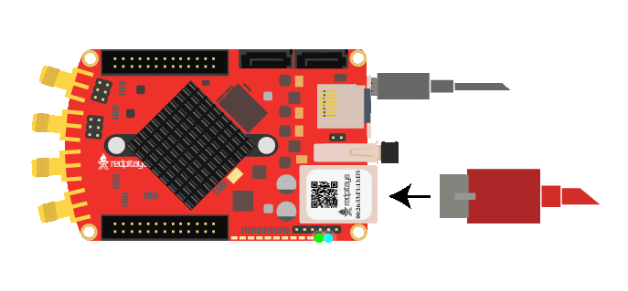

.. _troubleshooting_status_leds:

#####################
步骤 2：状态 LED
#####################

本节将检查 Red Pitaya 板卡上的状态 LED，以确定是否存在硬件问题。状态 LED 能提供有关板卡状态的重要信息，并帮助识别潜在问题。

Red Pitaya 状态 LED 说明：

    * :green:`绿色 LED` — 电源正常。
    * :blue:`蓝色 LED` — FPGA 镜像已加载，OS 已启动。
    * :red:`红色 LED` — CPU 心跳。
    * :orange:`橙色 LED` — SD 卡访问。

|

逐步检查 LED
=======================

按照以下步骤操作；当板卡状态与其中一种 LED 模式相符时停止检查。

1. 首先检查绿色 LED
----------------------------------

在所有状态 LED 中，:green:`绿色 LED` 最为重要，因为它指示 Red Pitaya 板卡是否正常供电。

如果 :green:`绿色 LED` **熄灭** 或 **闪烁**，说明存在电源问题。

1.  **电源功能** — 确认电源已插入 ``PWR`` USB 端口。
2.  **线缆问题** — 重新插拔线缆，或尝试另一根线缆。
3.  **确认供电规格**：

    * **第二代** 板卡需要 **5 V / 3 A**
    * **初代** 板卡需要 **5 V / 2 A**
    * **SIGNALlab 250-12** 需要 **24 V / 0.5 A**

    计算机 USB 端口通常只能提供 0.5 A，无法满足要求。

4.  **问题仍然存在** — 如果问题仍然存在，说明供电部分可能存在硬件故障。请 :ref:`联系我们 <report_problem>`。

|

2. 绿色常亮、蓝色熄灭、橙色微亮或熄灭
-----------------------------------------------------

这通常表示从 SD 卡加载 Red Pitaya 文件系统时出现问题。

1.  **电源功能** — 确认电源已插入 ``PWR`` USB 端口。
2.  **microSD 卡** — 确认已插入 microSD 卡。
3.  **Red Pitaya OS** — 确认 SD 卡上已安装 Red Pitaya OS。

    * 如有需要，请 :ref:`在 SD 卡上重新安装 Red Pitaya OS <prepareSD>`。
    * Red Pitaya 随附的 SD 卡通常已包含官方 OS，但少数情况下可能为空卡或版本过旧。

4.  **第三方 OS** — 如果使用第三方 OS（例如 **Pavel Demin 的 Alpine Linux**），这可能是正常现象。

    * 在某些第三方镜像中，状态 LED 通常保持熄灭。
    * 请查阅 |red_pitaya_notes| 或相关第三方文档。

5.  **EEPROM 读取问题** — 检查 ``hw_rev`` 值是否错误，或 EEPROM 是否读取失败。

    * OS 2.00 及更高版本要求 EEPROM 中具有正确的 ``hw_rev``。
    * 如果问题在 OS 更新后出现，请按照 GitHub issue |#250| 验证 ``hw_rev``。
    * 无论是否在保修期内，均适用该 issue 中的 RMA 条款。

6.  **SD 卡损坏** — 检查 SD 卡是否损坏。

    * 在另一块 Red Pitaya 板卡中测试该 SD 卡；或者
    * 更换 SD 卡并安装全新的 OS 镜像。

7.  **检查 SD 卡座** — 检查 SD 卡座中是否有弯曲的引脚。如果有引脚向上弯曲、无法与 SD 卡引脚接触，请取出 SD 卡，用牙签或类似工具将其推回正常位置。

8.  **问题仍然存在** — 如果仍未解决，很可能存在硬件问题。请直接跳到 :ref:`步骤 4：串口控制台启动日志 <troubleshooting_serial_console>`，检查启动消息中是否存在 SD 卡或文件系统错误。

|

3. 绿色和蓝色常亮，红色和橙色反复循环
-----------------------------------------------------------

模式：

* :green:`绿色` 和 :blue:`蓝色` LED 亮起。
* :red:`红色` 和 :orange:`橙色` LED 短暂闪烁。
* 随后 :red:`红色` 和 :orange:`橙色` LED 同时保持亮起或熄灭约 2 秒。
* 同一循环不断重复。

这表示板卡陷入重启循环。

1. **确认外部时钟连接** — 如果使用 Red Pitaya 外部时钟版本，请确认外部时钟已连接到 :ref:`E2 <E2_orig_gen>`。
2. **确认外部时钟频率** — 确认输入时钟符合 :ref:`推荐的时钟规格 <faq_clock_specifications>`。
3. **问题仍然存在** — 如果时钟连接和规格正确，但重启循环仍在继续，请 :ref:`联系我们 <report_problem>`。
4. **使用普通板卡？** — 如果使用普通 Red Pitaya 板卡（非外部时钟版本），这可能表示存在硬件故障。请 :ref:`联系我们 <report_problem>`。

.. note::

    使用 OS 3.00 及更高版本时，Red Pitaya 外部时钟板卡即使未连接外部时钟也会启动，但没有时钟时板卡无法正常工作。

|

4. 绿色常亮、蓝色熄灭、红色呈心跳模式、橙色在启动期间活动
----------------------------------------------------------------------

模式：

* :green:`绿色` LED 常亮。
* :blue:`蓝色` LED 熄灭。
* :red:`红色` LED 以心跳模式闪烁。
* :orange:`橙色` LED 在启动期间偶尔闪烁，通常约 1 分钟后熄灭。

此行为非常接近正常启动模式，但启动完成后 :blue:`蓝色` LED 应当亮起。

1. **蓝色 LED 损坏** — 检查 :blue:`蓝色` LED 是否损坏。如果板卡仍在保修期内，我们将予以更换。

|

5. 绿色和蓝色常亮、红色呈心跳模式、橙色在启动期间活动
----------------------------------------------------------------------

模式：

* :green:`绿色` 和 :blue:`蓝色` LED 常亮。
* :red:`红色` LED 以心跳模式闪烁。
* :orange:`橙色` LED 在启动期间偶尔闪烁，通常约 1 分钟后熄灭。

这是正常行为，表示板卡启动正常、硬件工作正常。

|

后续步骤
============

如果已完成 LED 检查但问题仍然存在，请继续执行下一项故障排除步骤：

* 无法连接 Web 界面？请执行 :ref:`步骤 3：网络连接 <troubleshooting_network>`，或点击本页面右下角的 **下一页** （两者会进入同一页面）。
* Web 界面或信号存在问题？请执行 :ref:`步骤 5：硬件连接 <troubleshooting_hardware_connections>`。

.. substitutions

.. |red_pitaya_notes| replace:: :github:`Pavel Demin's Red Pitaya Notes <pavel-demin/red-pitaya-notes>`
.. |#250| replace:: :rp-github:`#250 <RedPitaya/issues/250>`
.. |#254| replace:: :rp-github:`#254 <RedPitaya/issues/254>`
